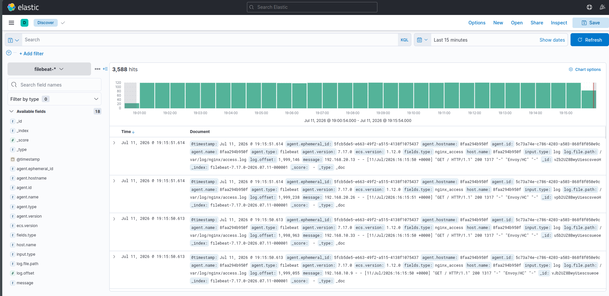
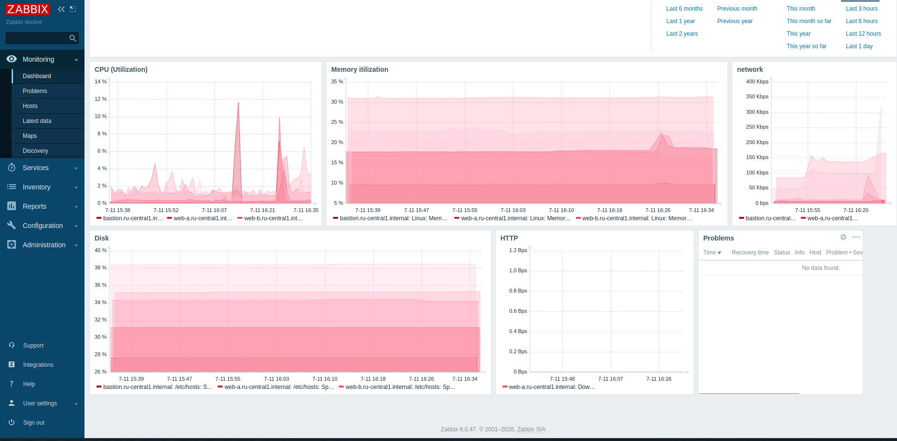
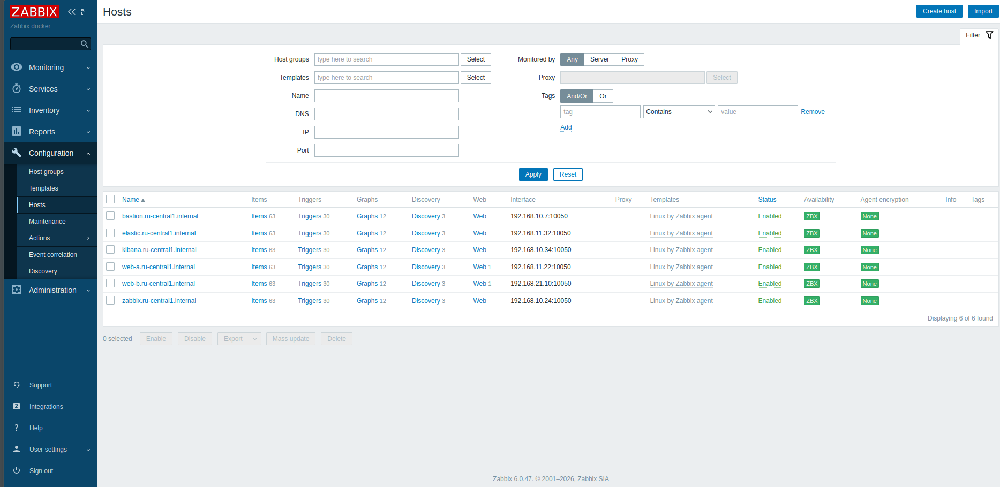
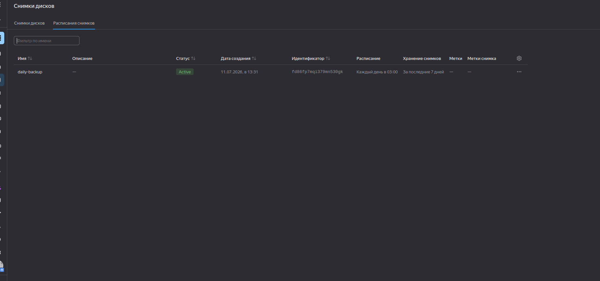

# Дипломный проект: production-инфраструктура в Yandex Cloud Петровский А.Н

Автоматизированное развёртывание отказоустойчивой инфраструктуры на Yandex Cloud с помощью **Terraform** и **Ansible**: веб-приложение за балансировщиком нагрузки, мониторинг Zabbix, стек логирования ELK (Elasticsearch + Kibana + Filebeat) — всё в контейнерах Docker.

## Содержание

- [Архитектура](#архитектура)
- [Компоненты инфраструктуры](#компоненты-инфраструктуры)
- [Структура репозитория](#структура-репозитория)
- [Требования](#требования)
- [Развёртывание](#развёртывание)
- [Проверка работоспособности](#проверка-работоспособности)
- [Доступы](#доступы)
- [Ключевые решения и компромиссы](#ключевые-решения-и-компромиссы)
- [Troubleshooting: с чем пришлось столкнуться](#troubleshooting-с-чем-пришлось-столкнуться)
- [Резервное копирование](#резервное-копирование)
- [Возможные улучшения](#возможные-улучшения)

---

## Архитектура

```
                              Интернет
                                 │
                    ┌────────────┴────────────┐
                    │   Application Load       │
                    │   Balancer (публичный)    │
                    └────────────┬────────────┘
                                 │ :80
              ┌──────────────────┴──────────────────┐
              │                                      │
   ┌──────────▼──────────┐              ┌───────────▼──────────┐
   │  web-a (zone A)      │              │  web-b (zone B)       │
   │  nginx + filebeat     │              │  nginx + filebeat      │
   │  приватная подсеть    │              │  приватная подсеть     │
   └──────────────────────┘              └───────────────────────┘
              │                                       │
              └──────────────────┬────────────────────┘
                                  │ логи (filebeat)
                                  ▼
                    ┌─────────────────────────┐
                    │   Elasticsearch          │
                    │   приватная подсеть       │
                    └─────────────┬───────────┘
                                  │
                    ┌─────────────▼───────────┐
                    │   Kibana                  │
                    │   публичная подсеть        │
                    └────────────────────────────┘

   ┌────────────────────┐        ┌─────────────────────┐
   │   Bastion Host       │◄──────┤   Zabbix Server        │
   │   публичный IP        │  SSH  │   публичный IP           │
   │   единств. вход SSH   │       │   Server+Web+DB (docker) │
   └──────────┬───────────┘       └──────────┬───────────────┘
              │  SSH (jump host)              │ агент на каждой ВМ
              └───────────────┬───────────────┘
                               ▼
                 web-a, web-b, elastic, kibana,
                     bastion, zabbix (сам себя)

   NAT Gateway — исходящий интернет для приватных ВМ (web-a, web-b, elastic)
```

## Компоненты инфраструктуры

| Компонент | Расположение | Публичный IP | Назначение |
|---|---|---|---|
| **bastion** | публичная подсеть, zone A | да | Единственная точка входа по SSH (jump host) |
| **web-a** | приватная подсеть, zone A | нет | nginx + filebeat |
| **web-b** | приватная подсеть, zone B | нет | nginx + filebeat |
| **zabbix** | публичная подсеть, zone A | да | Zabbix Server + Web + PostgreSQL (Docker) |
| **elastic** | приватная подсеть, zone A | нет | Elasticsearch |
| **kibana** | публичная подсеть, zone A | да | Kibana, подключена к Elasticsearch |
| **ALB** | публичная подсеть (обе зоны) | да | Балансировка трафика между web-a/web-b |
| **NAT Gateway** | — | — | Исходящий интернет для приватных ВМ |

Все ВМ: 2 vCPU (20% Intel Ice Lake), RAM 2–4 ГБ, 10 ГБ network-hdd — согласно требованию задания к минимальной конфигурации.

## Структура репозитория

```
.
├── terraform/
│   ├── network.tf          # VPC, подсети, NAT gateway, route table
│   ├── security_groups.tf  # Security Groups для всех сервисов
│   ├── bastion.tf          # Bastion host
│   ├── web.tf              # web-a, web-b, target group
│   ├── zabbix.tf           # Zabbix Server VM
│   ├── elastic.tf          # Elasticsearch VM
│   ├── kibana.tf           # Kibana VM
│   ├── alb.tf              # Target group, backend group, HTTP router, ALB
│   ├── static_ips.tf       # Зарезервированные IP (bastion)
│   ├── backup.tf           # Snapshot schedule для всех дисков
│   ├── variables.tf
│   └── outputs.tf
├── ansible/
│   ├── playbooks/
│   │   └── site.yml        # Главный playbook
│   ├── roles/
│   │   ├── docker/             # Установка Docker на все хосты
│   │   ├── zabbix-agent/       # Zabbix Agent (Docker) на все хосты
│   │   ├── zabbix-docker/      # Zabbix Server + Web + Postgres
│   │   ├── zabbix-register/    # Автоматическая регистрация хостов через Zabbix API
│   │   ├── nginx-docker/       # nginx + статический сайт
│   │   ├── filebeat-docker/    # Filebeat → Elasticsearch
│   │   └── elk-docker/         # Elasticsearch / Kibana
│   ├── group_vars/
│   ├── requirements.yml    # community.zabbix (pinned <2.0.0)
│   └── inventory.ini       # генерируется автоматически
├── generate_inventory.sh   # Генерация Ansible inventory из Terraform outputs
├── Makefile                # Все команды развёртывания и обслуживания
└── README.md
```

## Требования

- Yandex Cloud аккаунт с активным биллингом/грантом
- `terraform` >= 1.5
- `ansible` >= 2.14, `ansible-galaxy`
- `yc` CLI, аутентифицированный в нужном облаке/каталоге
- SSH-ключевая пара (`~/.ssh/id_ed25519`)
- `make`

## Развёртывание

```bash
# 1. Инициализация Terraform
make tf-init

# 2. Просмотр плана (опционально)
make tf-plan

# 3. Применение — создаёт всю инфраструктуру
#    (используется -parallelism=1 из-за квот Yandex Cloud на создание внешних IP)
make tf-apply

# 4. Установка Ansible-зависимостей (community.zabbix)
make galaxy-install

# 5. Генерация inventory + полная настройка всех сервисов
make ansible-all

# Всё сразу одной командой:
make deploy
```

После `make ansible-all` автоматически:
- ставится Docker на всех 6 ВМ
- разворачивается Zabbix Agent на всех ВМ
- поднимается nginx + filebeat на web-a/web-b
- разворачивается Zabbix Server (Postgres + Server + Web) на zabbix
- разворачивается Elasticsearch и Kibana
- все 6 хостов автоматически регистрируются в Zabbix через API с шаблоном `Linux by Zabbix agent`

## Проверка работоспособности

```bash
make info    # вывести все актуальные IP и ссылки
make test    # curl на ALB — проверка сайта
```

- **Сайт**: `http://<alb_public_ip>/`
- **Zabbix**: `http://<zabbix_public_ip>:8080` (Admin / zabbix — сменить пароль после первого входа)
- **Kibana**: `http://<kibana_public_ip>:5601` → Discover → индекс-паттерн `filebeat-*`

SSH-доступ (только через bastion как jump host):

```bash
make ssh-bastion
make ssh-web-a
make ssh-web-b
make ssh-zabbix
make ssh-elastic
make ssh-kibana
```

## Доступы

> ⚠️ Публичные IP у zabbix/kibana **динамические** — обновляются при каждом рестарте ВМ. Актуальные значения — командой `make info` непосредственно перед демонстрацией.

| Ресурс | Актуальность |
|---|---|
| Сайт (ALB) | см. `make info` |
| Zabbix | см. `make info`, порт 8080 |
| Kibana | см. `make info`, порт 5601 |

### Web


### elastic



## Zabbix 




## Резервное копирование



